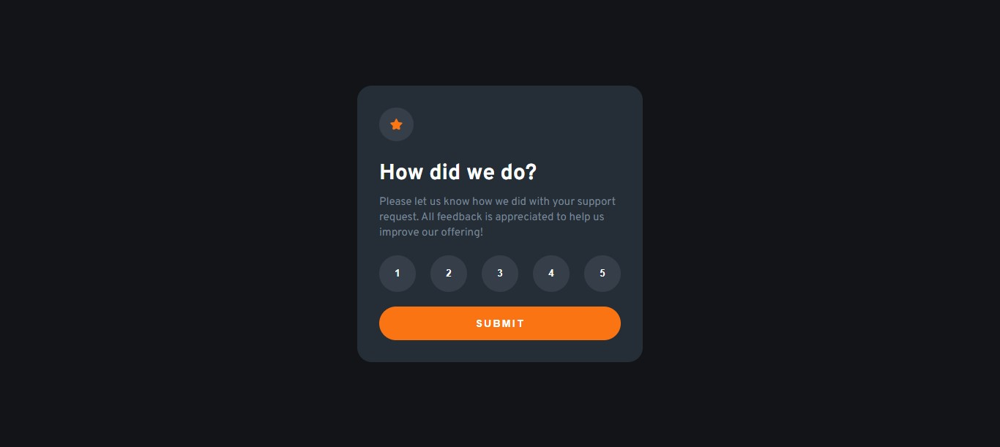

# Frontend Mentor - Interactive rating component solution

Essa é minha solução para o [Interactive rating component challenge on Frontend Mentor](https://www.frontendmentor.io/challenges/interactive-rating-component-koxpeBUmI). Os desafios do Frontend Mentor lhe ajudam a aprimorar habilidades de codificação construindo projetos realistas.

Veja a versão original [aqui](README.md)

## Tabela de conteúdos

- [Overview](#overview)
  - [O desafio](#o-desafio)
  - [Screenshot](#screenshot)
  - [Links](#links)
- [Meu progresso](#meu-progresso)
  - [Feito com](#feito-com)
  - [O que aprendi](#o-que-aprendi)
  - [Desenvolvimento contínuo](#desenvolvimento-contínuo)
- [Autor](#autor)

## Overview

### O desafio

Users should be able to:

- Ver os estados de foco para elementos interativos na página
- Selecionar e submeter uma avaliação
- Ver o card "Obrigado" depois de selecionar uma avaliação

### Screenshot

### Links

- Solution URL: [Solution](#)
- Live Site URL: [Live Site](#)

## Meu progresso

### Feito com

- Marcação HTML6 semântico
- HTML & CSS puros
- Propriedades CSS personalizadas
- Flexbox

Feito dentro do tempo de
2 horas e 18 minutos

### O que aprendi

Esta foi minha oportunidade de praticar meu JS pela primeira vez. Estou feliz de não ter pesquisado uma solução no Google. Apenas pesquisei para uma documentação de algo específico, como a propriedade 'classList'. Na maioria das vezes, confiei apenas no 'Ctrl' + 'Espaço' para procurar o que precisava e em alguns projetos que tive em alguns eventos dos quais participei.

### Desenvolvimento contínuo

Eu quero melhorar no JS por agora. Esse foi só o começo e estou confiante e procurando melhorar essas habilidades :D 

## Autor

- Frontend Mentor - [@Gabriel-H502](https://www.frontendmentor.io/profile/Gabriel-H502)
- FreeCodeCamp - [@Gabriel-H502](https://www.freecodecamp.org/Gabriel-H502) 
- GitHub - [Gabriel-H502](https://github.com/Gabriel-H502)
