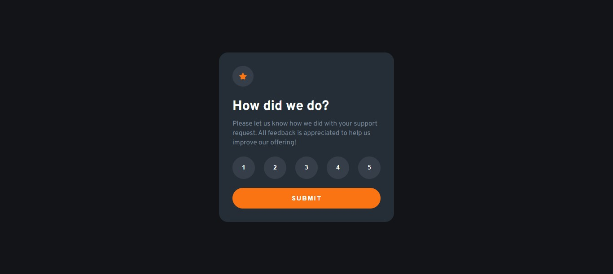

# Frontend Mentor - Interactive rating component solution

This is a solution to the [Interactive rating component challenge on Frontend Mentor](https://www.frontendmentor.io/challenges/interactive-rating-component-koxpeBUmI). Frontend Mentor challenges help you improve your coding skills by building realistic projects.

See the brazilian version [here](README-br.md)

## Table of contents

- [Overview](#overview)
  - [The challenge](#the-challenge)
  - [Screenshot](#screenshot)
  - [Links](#links)
- [My process](#my-process)
  - [Built with](#built-with)
  - [What I learned](#what-i-learned)
  - [Continued development](#continued-development)
- [Author](#author)

## Overview

### The challenge

Users should be able to:

- See hover states for all interactive elements on the page
- Select and submit a number rating
- See the "Thank you" card state after submitting a rating

### Screenshot

### Links

- Solution URL: [Solution](#)
- Live Site URL: [Live Site](#)

## My process

### Built with

- Semantic HTML5 markup
- Pure HTML & CSS
- CSS custom properties
- Flexbox

Done within the time of
2 hours and 18 minutes

### What I learned

This was my oportunity to pratice my JS for the first time. I'm feeling proud of not actually googled a solution to it. Just for a documentation of something specific, like 'classList' property. For the most part, just relyed on 'Ctrl' + 'Space' to search what I needed and looked for some projects I had from some events I joined.

### Continued development

I want to get better on JS for now. This was a startup and I'm feeling confident and looking forward to upgrade these skills :D

## Author

- Frontend Mentor - [@Gabriel-H502](https://www.frontendmentor.io/profile/Gabriel-H502)
- FreeCodeCamp - [@Gabriel-H502](https://www.freecodecamp.org/Gabriel-H502) 
- GitHub - [Gabriel-H502](https://github.com/Gabriel-H502)
